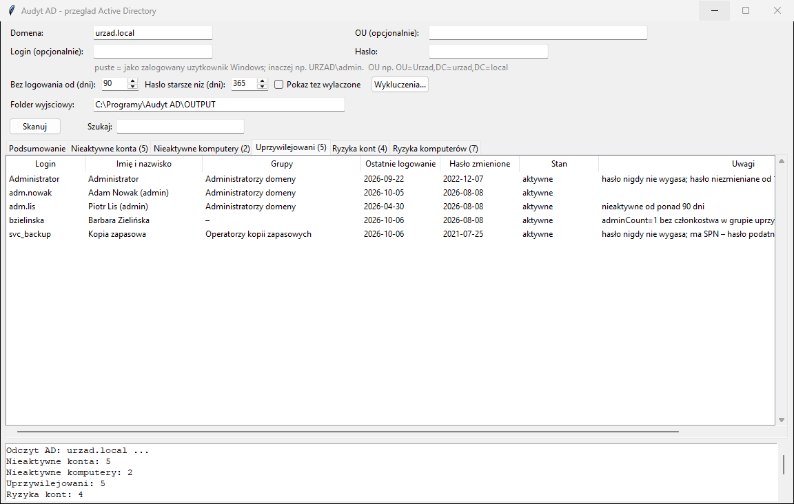
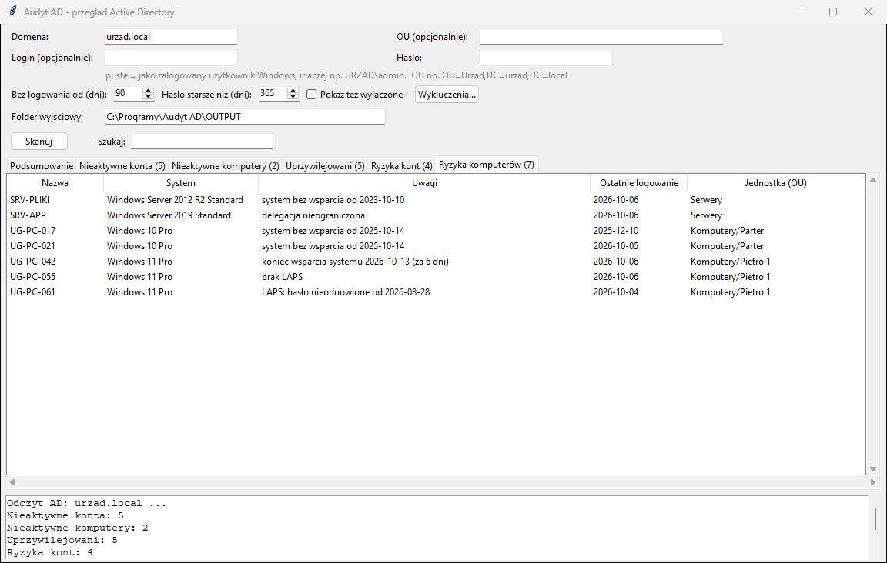

# Audyt AD — przegląd Active Directory

Program dla administratora IT. Jednym kliknięciem robi przegląd domeny
**Active Directory** i pokazuje to, o co pyta każdy audyt bezpieczeństwa
(KRI, RODO, audyt wewnętrzny, test penetracyjny):

- konta i komputery, które **nie logowały się od N dni**,
- kto ma **uprawnienia administratora domeny** (także przez grupy zagnieżdżone),
- konta z **ryzykownymi ustawieniami** (hasło nie wygasa, hasło niewymagane,
  AS-REP roasting, Kerberoasting, delegacja…),
- komputery z **systemem bez wsparcia**, **bez LAPS**, z delegacją nieograniczoną,
- **podsumowanie domeny**: polityka haseł, blokada kont, hasło `krbtgt`,
  konto Gość, wbudowany Administrator, MachineAccountQuota, poziom funkcjonalny.

Program **tylko czyta** AD zwykłym kontem domenowym. Niczego nie wyłącza,
nie usuwa i nie zmienia. Wynik jest w oknie i w pliku Excela.


*(na zrzutach dane fikcyjne)*

## Szybki start

1. Zainstaluj [Pythona](https://www.python.org/downloads/windows/) (zaznacz **„Add python.exe to PATH”**).
2. Pobierz program: **Code → Download ZIP**, rozpakuj np. do `C:\Programy\Audyt AD`.
3. Uruchom **`install.bat`** (raz). Na końcu musi pojawić się „selftest OK”.
4. Uruchom **`uruchom.bat`** → sprawdź pole **Domena** → **Skanuj**.
5. Zacznij od zakładki **Podsumowanie**, potem **Uprzywilejowani**.
   Raport Excela jest w folderze `OUTPUT`.

📘 **Pełna instrukcja dla administratora: [docs/INSTRUKCJA.md](docs/INSTRUKCJA.md)**.
Jest w niej pierwszy skan krok po kroku i jak czytać wyniki. Dla każdej uwagi
podaje, **co z nią zrobić** (z poleceniami PowerShell). Do tego procedura
przeglądu kwartalnego, rozwiązywanie problemów i słownik pojęć.

## Spis treści

- [Zakładki](#zakładki): [Podsumowanie](#podsumowanie) ·
  [Nieaktywne](#nieaktywne-konta--nieaktywne-komputery) ·
  [Uprzywilejowani](#uprzywilejowani) · [Ryzyka kont](#ryzyka-kont) ·
  [Ryzyka komputerów](#ryzyka-komputerów)
- [Wyszukiwanie, sortowanie, szczegóły](#wyszukiwanie-sortowanie-szczegóły)
- [Wykluczenia](#wykluczenia)
- [Plik Excela](#plik-excela)
- [Dokładność daty logowania](#dokładność-daty-logowania)
- [Wymagania](#wymagania) · [Instalacja](#instalacja-jednorazowo) · [Jak używać](#jak-używać)
- [Prywatność](#prywatność) · [Aktualizacje](#aktualizacje) ·
  [Ograniczenia](#ograniczenia) · [Testy](#testy)

## Zakładki

### Podsumowanie

Lista kontroli z oceną **OK / UWAGA / INFO**. Wiersze z UWAGĄ są
podświetlone na czerwono (w oknie i w Excelu).

| Kontrola | UWAGA, gdy | Dlaczego |
|----------|------------|----------|
| Poziom funkcjonalny domeny | starszy niż 2012 R2 | brak nowszych zabezpieczeń Kerberos, kontrolery na starych systemach |
| Minimalna długość hasła | mniej niż 12 znaków | współczesne zalecenia (np. NIST SP 800-63B: 15 znaków dla haseł bez MFA) |
| Blokada konta po błędnych hasłach | brak blokady | zgadywanie haseł bez ograniczeń |
| Maksymalny wiek hasła | (informacja) | |
| MachineAccountQuota | większe niż 0 | każdy użytkownik może dodać do domeny 10 komputerów (domyślne ustawienie, wykorzystywane w atakach) |
| Hasło konta `krbtgt` | starsze niż 180 dni | klucz, którym podpisane są wszystkie bilety Kerberos; po wycieku umożliwia „Golden Ticket” |
| Konto Gość | włączone | |
| Wbudowany Administrator | hasło starsze niż próg „Hasło starsze niż” | konto, którego nie da się zablokować błędnymi hasłami |
| LAPS | nie wdrożony albo nie na wszystkich komputerach | to samo hasło lokalnego administratora na wielu komputerach |
| Liczby z pozostałych zakładek | większe niż 0 | |

Polityka haseł to **domyślna polityka domeny**. Szczegółowe zasady haseł
(PSO, „Fine-Grained Password Policy”) dla wybranych grup nie są pokazywane.

### Nieaktywne konta / Nieaktywne komputery

Obiekty bez logowania do domeny od podanej liczby dni (domyślnie 90),
posortowane od „nigdy” i najdłużej nieaktywnych.

- Konto, które **nigdy się nie logowało**, jest pokazywane tylko wtedy,
  gdy utworzono je wcześniej niż N dni temu. Konto założone wczoraj dla
  nowego pracownika nie jest „martwe”.
- **Wyłączone** obiekty są domyślnie pomijane. Pokazuje je opcja
  **„Pokaż też wyłączone”**, np. przed ich usunięciem.

### Uprzywilejowani

Wszyscy członkowie grup chronionych przez AD (`adminCount=1`): Administratorzy
domeny, Administratorzy przedsiębiorstwa, Administratorzy schematu,
Administratorzy, Operatorzy kont / serwerów / drukarek / kopii zapasowych
i grupy w nich zagnieżdżone. Członkostwo pośrednie (grupa w grupie) jest
rozwijane.



W kolumnie **Uwagi** dodatkowo:

- **„nieaktywne od ponad N dni”**: konto administratora, którego nikt nie używa, najlepiej wyłączyć,
- **„adminCount=1 bez członkostwa…”**: konto było kiedyś adminem i zostało usunięte
  z grupy, ale AD nie przywraca mu zwykłych uprawnień. Warto to wyczyścić
  (`adminCount` = puste i włączenie dziedziczenia uprawnień na koncie),
- ryzykowne ustawienia jak w zakładce „Ryzyka kont”.

Zakładka pokazuje **wszystkich** członków, także wyłączonych i z listy wykluczeń.

### Ryzyka kont

Włączone konta, które mają co najmniej jedną z poniższych cech:

| Uwaga | Co to znaczy |
|-------|--------------|
| hasło niewymagane | konto może mieć puste hasło (`PASSWD_NOTREQD`) |
| hasło z odwracalnym szyfrowaniem | hasło przechowywane w postaci możliwej do odczytania |
| hasło nigdy nie wygasa | zwykle konta techniczne; powinny mieć długie, losowe hasło lub gMSA |
| delegacja nieograniczona | konto może podszywać się pod każdego, kto się do niego uwierzytelni |
| tylko szyfrowanie DES | przestarzałe, łamalne szyfrowanie |
| bez preautoryzacji Kerberos | **AS-REP roasting**: każdy może pobrać skrót hasła i łamać go offline |
| ma SPN | **Kerberoasting**: każdy użytkownik domeny może pobrać skrót hasła konta usługi; groźne przy słabym/starym haśle |
| hasło niezmieniane od N dni | starsze niż próg „Hasło starsze niż” (domyślnie 365 dni) |
| konto wygasło | data wygaśnięcia minęła, konto nadal jest w AD |

### Ryzyka komputerów



| Uwaga | Kiedy |
|-------|-------|
| system bez wsparcia od … | Windows XP/Vista/7/8/8.1, Windows 10 (koniec 14.10.2025, z wyjątkiem LTSC), stare wersje Windows 11, Server 2003–2012 R2 |
| koniec wsparcia systemu … (za N dni) | wsparcie kończy się w ciągu 180 dni, czas zaplanować aktualizację |
| brak LAPS | komputer nie ma hasła zarządzanego przez LAPS (gdy LAPS jest w domenie wdrożony) |
| LAPS: hasło nieodnowione od … | komputer jest aktywny, a hasło LAPS przeterminowane, czyli LAPS na nim nie działa |
| delegacja nieograniczona | serwer inny niż kontroler domeny z delegacją nieograniczoną |

- Daty końca wsparcia pochodzą z tabeli w programie (Microsoft Lifecycle).
  Windows 10 z płatnymi aktualizacjami ESU program nadal oznacza jako
  „bez wsparcia”, bo informacji o ESU nie ma w AD.
- Kontrolery domeny nie są sprawdzane pod kątem LAPS i delegacji, bo to dla nich normalne.
- Obsługiwany jest nowy **Windows LAPS** i stary **Microsoft LAPS**. Program sprawdza tylko
  datę ważności hasła. **Samych haseł nie odczytuje.**

## Wyszukiwanie, sortowanie, szczegóły

- **Szukaj**: filtruje wszystkie zakładki naraz (np. nazwisko, `Kadry`, `LAPS`).
- Kliknięcie **nagłówka kolumny** sortuje, a drugie kliknięcie odwraca kolejność.
- **Dwuklik** na wierszu pokazuje cały wiersz w okienku (długie uwagi).

## Wykluczenia

Konta techniczne, które celowo mają np. hasło bez wygasania, można pominąć.
Przycisk **Wykluczenia…** otwiera plik `wykluczenia.txt` w folderze programu:

```
# jedna nazwa w linii, można użyć * i ?
svc_*
SKANER-01
praktykant?
```

Wykluczone obiekty nie pojawiają się w zakładkach nieaktywnych i ryzyk.
Zakładka **Uprzywilejowani** zawsze pokazuje wszystkich, bo administratorów
nie wolno ukrywać. Liczba wykluczeń jest w Podsumowaniu. Plik nie jest
nadpisywany przez aktualizacje.

## Plik Excela

Po każdym skanie w folderze wyjściowym powstaje
`audyt_AD_<domena>_<data>.xlsx` z zakładkami jak w oknie: z filtrami,
datami jako daty Excela i wierszami z UWAGĄ na czerwono. Plik nadaje się
jako załącznik do dokumentacji przeglądu uprawnień.

## Dokładność daty logowania

Program używa atrybutu `lastLogonTimestamp`, który jest **kopiowany między
kontrolerami domeny z opóźnieniem do 14 dni**:

- data „ostatniego logowania” może być do ~14 dni starsza niż faktyczna,
- przy progu poniżej 14 dni program wyświetla ostrzeżenie,
- dla progów 30, 60, 90 dni to w pełni wystarcza (tak działa też
  `Search-ADAccount -AccountInactive` Microsoftu).

Logowanie tylko do poczty w chmurze (Exchange Online / Microsoft 365) nie
zmienia tej daty. Przed wyłączeniem konta upewnij się w kadrach, że
pracownik faktycznie odszedł.

## Wymagania

- **Komputer w domenie** i zwykłe konto domenowe. Uprawnienia administratora
  domeny nie są potrzebne.
- Albo komputer spoza domeny, który „widzi” kontroler domeny w sieci.
  Wtedy wpisz **Login** (`DOMENA\uzytkownik` albo `uzytkownik@domena.local`)
  i **Hasło**. Hasło nie jest nigdzie zapisywane.
- Windows 10/11 lub Windows Server, Python 3.9+.

Nie trzeba instalować RSAT ani modułu PowerShell ActiveDirectory. Program
łączy się z AD przez wbudowany w Windows mechanizm ADSI (LDAP).

## Instalacja (jednorazowo)

1. **Python**: pobierz z [python.org](https://www.python.org/downloads/windows/)
   (wersja 3.9 lub nowsza). W instalatorze zaznacz **„Add python.exe to PATH”**.
   Opcja „tcl/tk and IDLE” jest zaznaczona domyślnie i musi taka zostać.
2. **Program**: na stronie [github.com/DawidBochno/Audyt-AD](https://github.com/DawidBochno/Audyt-AD)
   kliknij zielony przycisk **Code → Download ZIP**. Rozpakuj archiwum,
   np. do `C:\Programy\Audyt AD`. Nie uruchamiaj programu z wnętrza ZIP-a.
3. Kliknij dwukrotnie **`install.bat`**. Instaluje biblioteki `openpyxl`
   i `pywin32` (potrzebny internet) i uruchamia test. Na końcu pojawia się
   **„selftest OK”**.
   Jeśli Windows pokaże „System Windows ochronił ten komputer”, kliknij
   **Więcej informacji → Uruchom mimo to**.
4. Program uruchamia się plikiem **`uruchom.bat`**.

## Jak używać

1. Uruchom `uruchom.bat`.
2. **Domena**: na komputerze w domenie wpisuje się sama (np. `urzad.local`).
3. **OU (opcjonalnie)**: zawęża konta i komputery do jednej jednostki, np.
   `OU=Urzad,DC=urzad,DC=local`. Podsumowanie domeny i grupy uprzywilejowane
   są zawsze sprawdzane dla całej domeny.
4. **Bez logowania od (dni)**: próg nieaktywności, domyślnie 90.
   **Hasło starsze niż (dni)**: próg starego hasła, domyślnie 365.
5. **Login / Hasło**: zostaw puste na komputerze w domenie.
6. Kliknij **Skanuj**.

Co dalej z wynikami (wyłączanie kont, czyszczenie uprawnień, LAPS,
`krbtgt`, polityka haseł) i rozwiązania typowych błędów są opisane
w [docs/INSTRUKCJA.md](docs/INSTRUKCJA.md).

## Prywatność

Raport zawiera loginy i nazwiska pracowników, czyli dane osobowe, oraz
słabe punkty domeny. Traktuj go jak dokument wewnętrzny. Folder `OUTPUT`
i plik `wykluczenia.txt` nie trafiają do repozytorium. Program nie wysyła
danych z AD nigdzie poza Twój komputer.

## Aktualizacje

Po uruchomieniu program sprawdza w tle na GitHubie, czy jest nowa wersja.
Jeśli jest, pyta **„Pobrać i zainstalować teraz?”**. Pobierane są tylko
zmienione pliki programu. `OUTPUT` i `wykluczenia.txt` nie są nadpisywane.
Do GitHuba trafia tylko zapytanie o listę plików, **nigdy dane z AD**.
Bez internetu program działa normalnie.
**Wyłączenie:** pusty plik `NIE_AKTUALIZUJ` w folderze programu.

## Ograniczenia

- Jedna domena naraz. Domeny podrzędne i zaufane lasy trzeba skanować osobno.
- Administratorzy przedsiębiorstwa i schematu istnieją tylko w domenie głównej lasu.
- Program nie sprawdza uprawnień (ACL) na obiektach AD, GPO, zaufania między
  domenami ani certyfikatów (ADCS). Do pełnego audytu bezpieczeństwa użyj
  dodatkowo np. PingCastle.
- Sprzętu, zainstalowanych programów i stanu aktualizacji nie ma w AD
  (pomysł na osobne narzędzie, patrz lista pomysłów w głównym README).

## Testy

```bash
python audyt_ad.py --selftest
```

Test działa bez domeny. Na sztucznej domenie (konta, komputery, grupy,
polityka) sprawdza:
- przeliczanie dat Windows (FILETIME), SID-ów i jednostek OU,
- wybór nieaktywnych,
- członków grup uprzywilejowanych i „pozostałości” `adminCount`,
- wszystkie flagi ryzyk,
- daty końca wsparcia systemów,
- LAPS (wdrożony / niewdrożony / niedziałający),
- kontrole Podsumowania, wykluczenia i plik Excela.

Samo połączenie z AD nie jest testowane automatycznie, bo GitHub nie ma
kontrolera domeny. Pierwsze uruchomienie w prawdziwej domenie warto
porównać z kilkoma kontami sprawdzonymi ręcznie w „Użytkownicy i komputery AD”.
