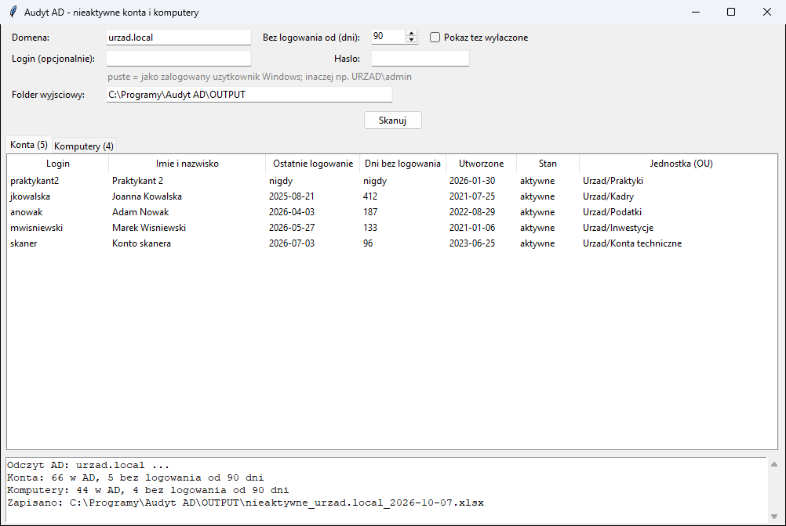

# Audyt AD — nieaktywne konta i komputery

Program dla administratora IT. Odczytuje z **Active Directory** konta
użytkowników i komputery, które **nie logowały się do domeny od podanej
liczby dni** (domyślnie 90), i pokazuje je w oknie oraz w pliku Excela.

Typowe zastosowania:

- konta byłych pracowników, praktykantów i zastępstw, których nikt nie wyłączył,
- komputery wycofane z użytku, ale wciąż istniejące w domenie,
- przegląd uprawnień wymagany przez RODO / KRI („martwe” konta to częste
  ustalenie audytu).

Program **tylko czyta** AD. Niczego nie wyłącza, nie usuwa i nie zmienia.
Decyzję, co zrobić z wykrytymi kontami, podejmujesz sam.



*(na zrzucie dane fikcyjne)*

## Co pokazuje

Dwie zakładki: **Konta** i **Komputery**.

| Kolumna | Skąd | Uwagi |
|---------|------|-------|
| Login / Nazwa | `sAMAccountName` / `name` | |
| Imię i nazwisko / System | `displayName` / `operatingSystem` | przy komputerach widać od razu stare systemy (Windows 7, Server 2012) |
| Ostatnie logowanie | `lastLogonTimestamp` | „nigdy” = konto nie zalogowało się ani razu |
| Dni bez logowania | wyliczone | lista posortowana od „nigdy” i najdłużej nieaktywnych |
| Utworzone | `whenCreated` | |
| Stan | `userAccountControl` | aktywne / wyłączone |
| Jednostka (OU) | `distinguishedName` | np. `Urzad/Kadry` |

Zasady:

- Konto, które **nigdy się nie logowało**, jest pokazywane tylko wtedy,
  gdy zostało utworzone wcześniej niż podana liczba dni temu. Konto
  założone wczoraj dla nowego pracownika nie jest „martwe”.
- **Wyłączone** konta i komputery są domyślnie pomijane (już ktoś się nimi
  zajął). Zaznacz **„Pokaż też wyłączone”**, żeby je zobaczyć, np. przed
  ich usunięciem.

Po każdym skanie w folderze `OUTPUT` powstaje plik
`nieaktywne_<domena>_<data>.xlsx` z dwiema zakładkami, filtrem
i datami jako daty Excela.

## Ważne: dokładność daty logowania

Program używa atrybutu `lastLogonTimestamp`, który jest **kopiowany między
kontrolerami domeny z opóźnieniem do 14 dni**. Dlatego:

- data „ostatniego logowania” może być do ~14 dni starsza niż faktyczna,
- przy progu poniżej 14 dni program wyświetla ostrzeżenie,
- dla przeglądu kont nieaktywnych 30, 60, 90 dni to w pełni wystarcza
  (tak samo działa narzędzie Microsoftu `Search-ADAccount -AccountInactive`).

Logowanie przez samą pocztę (Outlook Web, Exchange Online), VPN z innym
kontem albo aplikacje z własnymi kontami może nie zmieniać tej daty.
Przed wyłączeniem konta upewnij się w kadrach, że pracownik faktycznie odszedł.

## Wymagania

- **Komputer w domenie** i zwykłe konto domenowe — do odczytu tych danych
  nie są potrzebne uprawnienia administratora domeny.
- Albo komputer spoza domeny, który „widzi” kontroler domeny w sieci —
  wtedy wpisz **Login** (`DOMENA\uzytkownik` albo `uzytkownik@domena.local`)
  i **Hasło**. Hasło nie jest nigdzie zapisywane.
- Windows 10/11 lub Windows Server, Python 3.9+.

Nie trzeba instalować RSAT ani modułu PowerShell ActiveDirectory. Program
łączy się z AD przez wbudowany w Windows mechanizm ADSI.

## Instalacja (jednorazowo)

1. **Python** — pobierz z [python.org](https://www.python.org/downloads/windows/)
   (wersja 3.9 lub nowsza). W instalatorze zaznacz **„Add python.exe to PATH”**.
   Opcja „tcl/tk and IDLE” jest zaznaczona domyślnie i musi taka zostać.
2. **Program** — na stronie [github.com/DawidBochno/Audyt-AD](https://github.com/DawidBochno/Audyt-AD)
   kliknij zielony przycisk **Code → Download ZIP**. Rozpakuj archiwum,
   np. do `C:\Programy\Audyt AD`. Nie uruchamiaj programu z wnętrza ZIP-a.
3. Kliknij dwukrotnie **`install.bat`**. Instaluje biblioteki `openpyxl`
   i `pywin32` (potrzebny internet) i uruchamia test. Na końcu pojawia się
   **„selftest OK”**.
   Jeśli Windows pokaże „System Windows ochronił ten komputer”, kliknij
   **Więcej informacji → Uruchom mimo to**.
4. Program uruchamia się plikiem **`uruchom.bat`**.

## Jak używać

1. Uruchom `uruchom.bat`.
2. **Domena** — na komputerze w domenie wpisuje się sama (np. `urzad.local`).
   Jeśli pole jest puste, wpisz pełną nazwę domeny DNS.
3. **Bez logowania od (dni)** — próg, domyślnie 90.
4. **Login / Hasło** — zostaw puste na komputerze w domenie.
5. Kliknij **Skanuj**. Wynik pojawia się w zakładkach, a plik Excela
   w folderze `OUTPUT`.

## Prywatność

Raport zawiera loginy i nazwiska pracowników, czyli dane osobowe. Folder
`OUTPUT` nie trafia do repozytorium. Program nie wysyła danych z AD nigdzie
poza Twój komputer.

## Aktualizacje

Po uruchomieniu program sprawdza w tle na GitHubie, czy jest nowa wersja.
Jeśli jest, pyta **„Pobrać i zainstalować teraz?”**. Pobierane są tylko
zmienione pliki programu, folder `OUTPUT` nie jest nadpisywany. Do GitHuba
trafia tylko zapytanie o listę plików, **nigdy dane z AD**. Bez internetu
program działa normalnie.
**Wyłączenie:** pusty plik `NIE_AKTUALIZUJ` w folderze programu.

## Ograniczenia

- Jedna domena naraz. Zaufane domeny i lasy trzeba skanować osobno.
- Konta usług zarządzanych (gMSA) i konta systemowe (`krbtgt`, `Gość`)
  zwykle są wyłączone albo mają własny cykl — sprawdź je przed zmianą.
- Program nie pokazuje sprzętu, zainstalowanych programów ani stanu
  aktualizacji — tych danych nie ma w AD (pomysł na osobne narzędzie,
  patrz lista pomysłów w głównym README).

## Testy

```bash
python audyt_ad.py --selftest
```

Test działa bez domeny: na sztucznych obiektach AD sprawdza przeliczanie
dat Windows (FILETIME), odczyt jednostki OU, wybór nieaktywnych (konto
„nigdy”, nowe konto, wyłączone, próg), sortowanie i plik Excela.
Samo połączenie z AD nie jest testowane automatycznie (GitHub nie ma
kontrolera domeny). Pierwsze uruchomienie w prawdziwej domenie warto
porównać z kilkoma kontami sprawdzonymi ręcznie w „Użytkownicy i komputery AD”.
